

  
    
  

  <strong>Пакет расширений для Geely Coolray SX11A3</strong> 
  Magisk-модуль и приложение настройки для головного устройства на блоках <strong>IHU516</strong> и <strong>IHU535</strong> (<a href="https://4pda.to/forum/index.php?showtopic=1085149">прошивка Community</a>). Все функции доступны на обоих блоках, кроме связанного с приборкой. Установка одинаковая.

  
  
  
  
  

---

## ✨ О проекте

**Uranus** - это пакет расширений для настройки **основного экрана ГУ** и **приборной панели**: перенос приложений на приборную панель, виджеты домашнего экрана, голосовое управление, темы, кнопки руля и другие ранее недоступные опции.

Теперь поддерживаются блоки **535** и **516**. Все функции Uranus доступны на обоих, кроме всего связанного с приборкой.

---

## 🚀 Возможности

### 🖥️ Приборная панель

| Функция                   | Описание                                                                                                                                                                                                                                                                                                                                                                                                                                                                                                                                       |
| ------------------------- | ---------------------------------------------------------------------------------------------------------------------------------------------------------------------------------------------------------------------------------------------------------------------------------------------------------------------------------------------------------------------------------------------------------------------------------------------------------------------------------------------------------------------------------------------- |
| 📲 **Перенос приложений** | Перенос навигаторов и карт с экрана ГУ на приборку (свайп 3 пальцами или кнопка на руле, возврат — в обратную сторону). Только **IHU516**. Для каждого приложения выбирается способ: без завершения (приложение не закрывается) или с перезапуском (завершается и открывается заново на приборке). Без завершения удобнее, но часть программ — например 2ГИС — может закрыться или зависнуть; для них лучше перезапуск. Системный патч: после переноса перезапуском приложение не вылетает из‑за конфликта фокуса между экраном ГУ и приборкой |
| 🎵 **Медиа-виджет**       | Название трека и исполнитель на приборке (Bluetooth, Я.Музыка и др.); во вторую строку можно вывести длительность                                                                                                                                                                                                                                                                                                                                                                                                                              |
| 🗺️ **Виджет навигации**  | Маршрут и подсказки на приборной панели (зависит от версии Я.Навигатора)                                                                                                                                                                                                                                                                                                                                                                                                                                                                       |
| 🎨 **Темы оформления**    | Выбор тем приборной панели, в том числе тематических праздничных тем, выключение синхронизации светлой и темной темы с основным экраном ГУ                                                                                                                                                                                                                                                                                                                                                                                                     |

### ⚡ Основные возможности

#### Голосовое управление

| Функция                              | Описание                                                                                                                                                                                                              |
| ------------------------------------ | --------------------------------------------------------------------------------------------------------------------------------------------------------------------------------------------------------------------- |
| 🗣️ **Голосовая активация**          | Запуск голосового управления фразой, по кнопке руля или обоим способами                                                                                                                                               |
| 🎤 **Офлайн голосовое управление**   | Команды без интернета                                                                                                                                                                                                 |
| 📣 **Команды голосового управления** | Климат, окна, шторка, приложения, сплит, громкость. Команды можно комбинировать, например «открой люк и выключи кондиционер». «Поехали {избранное из панели «Куда едем?»}» сразу открывает навигатор и строит маршрут |

#### Кнопки руля и внешние устройства

| Функция                          | Описание                                                                                                                                                                                                             |
| -------------------------------- | -------------------------------------------------------------------------------------------------------------------------------------------------------------------------------------------------------------------- |
| 🎮 **Переназначение**            | Возможность назначить свои действия на штатные кнопки руля (короткое и долгое нажатие). Поддерживаются кнопки mode, voice, geely, call, mute, переключения треков                                                    |
| 📋 **Действия переназначения**   | Для назначения доступны системные действия (домой, назад и тд), запуск приложений, голосовое управление, управление функциями и опциями авто (вкл/выкл электронной заслонки выхлопа и др.), запуск сплит-скрина и тд |
| 🔇 **Управление громкостью USB** | Управление громкостью ГУ теперь доступно через любые HID-совместимые usb клавиатуры и девайсы с резистивными регуляторами громкости (крутилками)                                                                     |

#### Виджеты рабочего стола и статусбар

| Функция                       | Описание                                                                                                                                                                                                                                                                                                                     |
| ----------------------------- | ---------------------------------------------------------------------------------------------------------------------------------------------------------------------------------------------------------------------------------------------------------------------------------------------------------------------------- |
| 📊 **Индикация в статусбаре** | Настраиваемые пиктограммы и информация о заряде АКБ, остатке топлива в литрах, запасе хода, количестве пойманных спутников GPS, индикация подогревов сидений и статусе переноса приложения на приборную панель. Можно вывести название текущего трека с иконкой источника медиа. Иконки корректнее ведут себя при смене темы |
| 🔘 **Smart Area - 3 кнопки**  | Настраиваемые слоты быстрого запуска приложений в панели Smart Area на домашнем экране; у трёх кнопок карточки в левой части домашнего экрана можно спрятать названия приложений                                                                                                                                             |
| 📱 **Smart Area - 9 слотов**  | Раскрывающаяся сетка 3×3 под Smart Area для быстрого запуска 9 любых приложений                                                                                                                                                                                                                                              |
| 🎵 **Uranus.Медиа**           | Улучшенное отображение трека и управление — любой медиаисточник, включая Bluetooth: **прогресс-бар**, переключение **локальный плеер ↔ телефон (BT)** прямо с виджета (при подключённом телефоне), обложка ID3                                                                                                               |
| 🚗 **Uranus.Авто**            | Виджет настроек автомобиля: 10 настраиваемых слотов — память сидений, окна, климат, режим мойки, **электронная заслонка выхлопа**, сплит, смена темы и др. Все функции климата можно вынести в этот виджет                                                                                                                   |
| ❄️ **Uranus.Климат**          | Компактный климат-виджет на рабочем столе. Смена тем виджета климата на навбаре и редизайн иконок режимов ion / g-clean / eco                                                                                                                                                                                                |
| 🌤️ **Uranus.Погода**         | Виджет погоды для лаунчера (отдельный APK)                                                                                                                                                                                                                                                                                   |
| 🧩 **Свои виджеты**           | Возможность разработки и подключения пользовательских виджетов в каталог лаунчера                                                                                                                                                                                                                                            |

#### Основной экран ГУ

| Функция                                     | Описание                                                                                                                                                                                                                                                                                                                    |
| ------------------------------------------- | --------------------------------------------------------------------------------------------------------------------------------------------------------------------------------------------------------------------------------------------------------------------------------------------------------------------------- |
| 🪟 **Разделение экрана**                    | Запуск сплит скрина с руля, голосом или с виджета лаунчера. Свайп двумя пальцами влево или вправо — действие настраивается как на кнопках руля                                                                                                                                                                              |
| ↔️ **Изменение размера в сплите**           | Свободное перетаскивание разделителя между окнами                                                                                                                                                                                                                                                                           |
| ➡️ **Изменение дефолтных пропорций сплита** | Настройка дефолтных пропорций запуска сплит скрина, отличных от стоковых 620/1280                                                                                                                                                                                                                                           |
| 🧭 **Навбар**                               | До семи кнопок, можно менять местами и отключать. В слот — штатное действие, приложение, сплит или виджет климата (режим обдува). Долгое нажатие «Панель / Домой / Назад» настраивается отдельно                                                                                                                            |
| 📍 **Куда едем?**                           | Панель из любого приложения свайпом или кнопкой руля: поиск по адресу, голосовой поиск, сохранение в избранное и передача маршрута в Я.Навигатор или 2ГИС (навигатор выбирается в настройках). На 516 навигатор сам запускается на приборке с маршрутом, на 535 — на ГУ. Для Я.Навигатора нужен патч из комплекта           |
| 🌓 **Темы день/ночь**                       | Автопереключение основного экрана ГУ и приборной панели по времени рассвета и заката; время можно сдвинуть на 15 / 30 / 45 минут — расписание пересчитается при смене места                                                                                                                                                 |
| 🔔 **Центр уведомлений**                    | Полноценный центр уведомлений в шторке с поддержкой функциональных кнопок управления каждого приложения (например добавить в избранное в плеере) и с возможностью подробной настройки уведомлений из стоковых настроек Android. Шторка открывается быстрее. На 535 исправлена ошибка падения шторки и исчезновения виджетов |
| 🔒 **КВН в шторке**                         | Быстрый доступ к КВН-клиенту из панели уведомлений                                                                                                                                                                                                                                                                          |
| 🔊 **Полоска громкости**                    | Редизайн: вертикальная капсула, громкость можно менять пальцем                                                                                                                                                                                                                                                              |

#### Автомобиль и климат

| Функция                           | Описание                                                                                                                                                                                    |
| --------------------------------- | ------------------------------------------------------------------------------------------------------------------------------------------------------------------------------------------- |
| 🔇 **Приглушение медиа (R)**      | Настраиваемая глубина приглушения музыки при задней передаче и работе парктроников/камеры; можно не приглушать совсем (осторожно: на большой громкости можно не услышать писк парктроников) |
| ⏯️ **Start-Stop в Eco**           | При переходе в режим Eco автоматически отключает систему Start-Stop (однократно, без постоянного мониторинга)                                                                               |
| 🔊 **Заслонка выхлопа**           | Вкл/выкл **электронной заслонки выхлопа** и выбор уровня открытия (слабый / средний / жёсткий) — с кнопки руля, виджета «Авто» или из настроек; доступно в режиме **Спорт**                 |
| 🌡️ **CN климат XCHvac**          | Замена штатного приложения климата на китайскую версию с переводом, красивыми ресурсами и исправленным багом анимации G-clean                                                               |
| 📐 **Климат без полноэкрана**     | Кнопки климата на панели меняют температуру без огромного окна; климат целиком по-прежнему открывается иконкой в навбаре                                                                    |
| 💨 **Уведомления обдува климата** | Короткая панель с текущим режимом обдува при нажатии кнопки MODE                                                                                                                            |
| 🔁 **Климат при запуске авто**    | Применение выбранных настроек климата при запуске авто. Интенсивность обдува в авто-режиме сохраняется после перезагрузки                                                                   |
| 🔥 **Автоподогрев сидений**       | Настройка автоподогревов сидений (при их наличии) — уровень и длительность                                                                                                                  |
| 🪟 **Шторка по зажиганию**        | Автозакрытие и автооткрытие шторки при выключении и включении зажигания                                                                                                                     |
| 🚗 **Настройки авто**             | Свет, люк, сиденья, зеркала, режимы вождения, безопасность, память сиденья                                                                                                                  |
| 🎬 **Анимация режима вождения**   | Отключение полноэкранной анимации при смене Adaptive/Eco/Comfort/Sport — переключатель во вкладке «Автомобиль» (отдельный модуль больше не нужен)                                           |

#### Сервис

| Функция                | Описание                                                                               |
| ---------------------- | -------------------------------------------------------------------------------------- |
| 🔧 **Инженерное меню** | Быстрый вход в OEM-инженерное меню из приложения                                       |
| 🛠️ **Диагностика**    | Отладка, логи, отступы для точной настройки отображения приложений на приборной панели |
| 📡 **ADB over Wi‑Fi**  | Включение отладки по сети из системных настроек Uranus                                 |

---

## 📸 Скриншоты

|                                                                                                                   |                                                                       |                                                                            |
| ----------------------------------------------------------------------------------------------------------------- | --------------------------------------------------------------------- | -------------------------------------------------------------------------- |
|  Виджеты Uranus и Uranus.Погода                    |  Сетка приложений              |  Сплит: Музыка и Навигатор               |
|  Перенос на приборку и обратно |                       |  Навигатор на приборке |
|  Слоты статусбара                                                      |  Кнопки руля и голос |  Климат XCHvac                         |

### Uranus 4.0

|                                                                          |                                                                   |                                                            |                                                                            |
| ------------------------------------------------------------------------ | ----------------------------------------------------------------- | ---------------------------------------------------------- | -------------------------------------------------------------------------- |
| 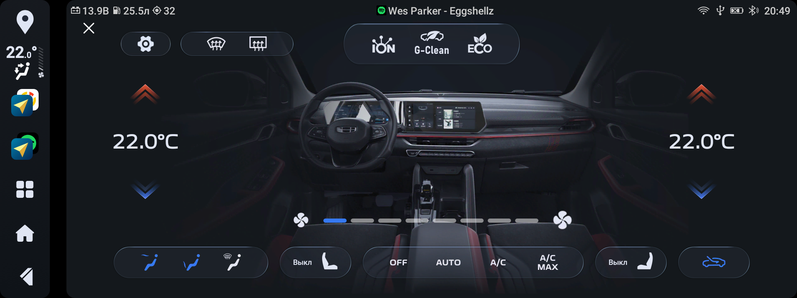 Климат XCHvac                        | 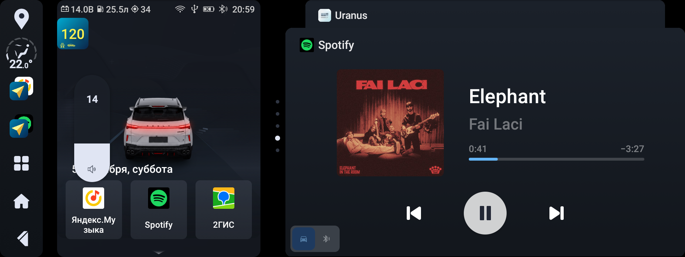 Полоска громкости         | 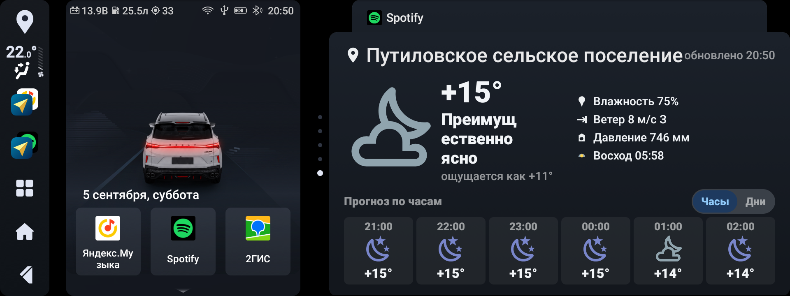 Домашний экран       | 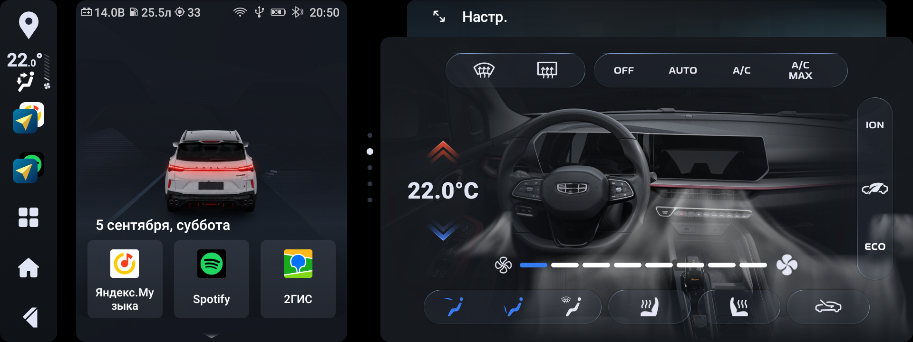 Климат-виджет                          |
| 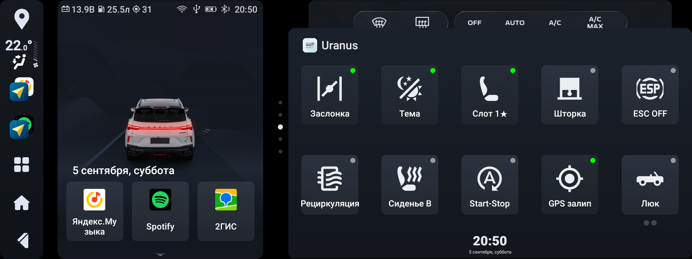 Виджет Uranus.Авто              | 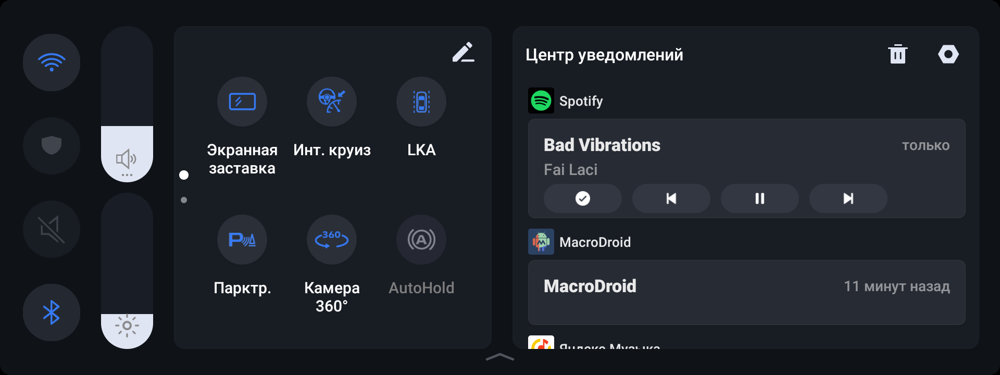 Плеер в шторке               | 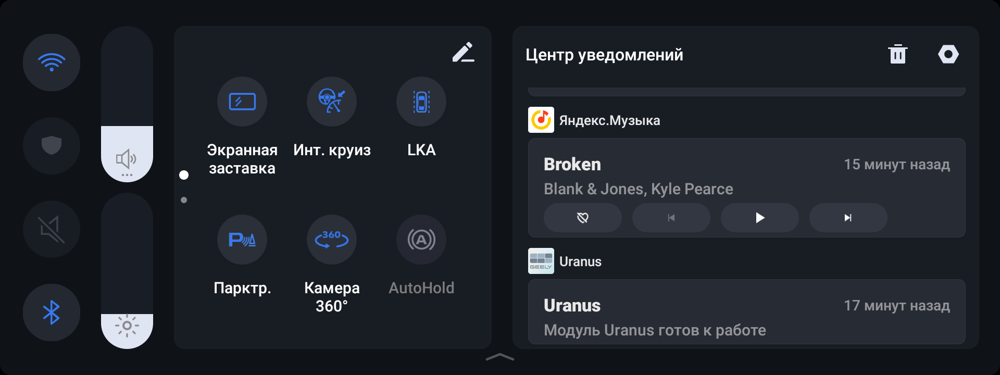 Центр уведомлений  | 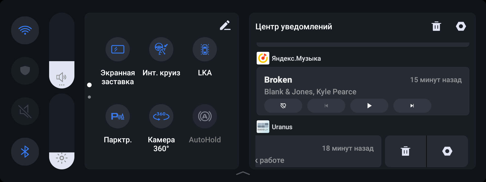 Кнопки в уведомлении            |
| 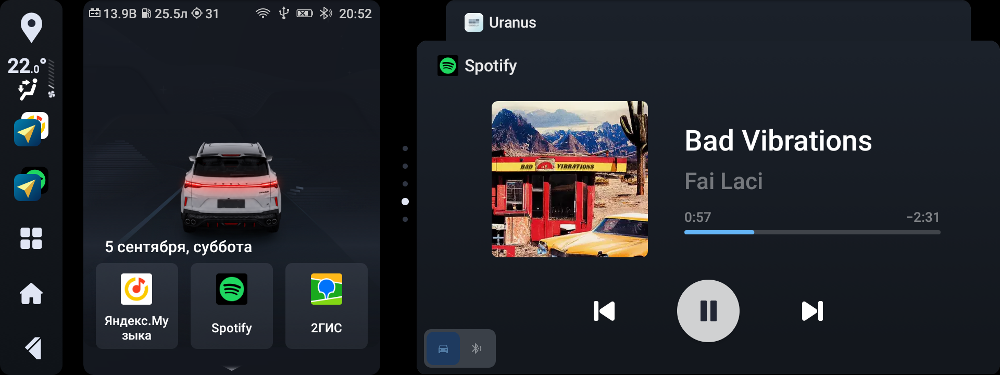 Uranus.Медиа                          | 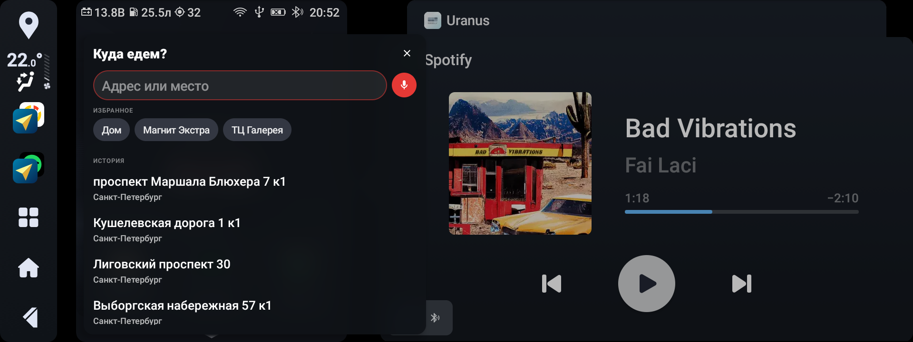 Куда едем?                       | 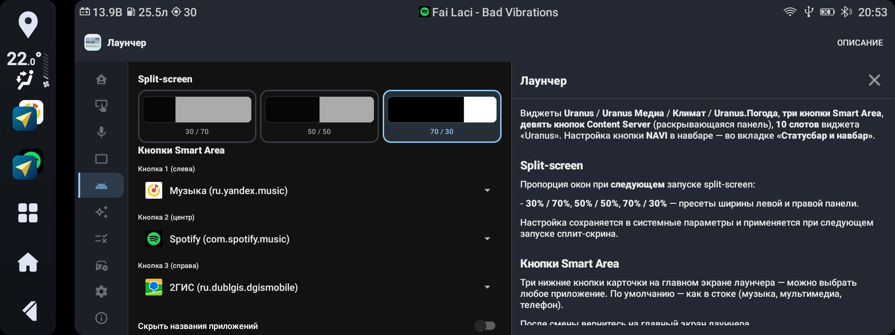 Лаунчер                      | 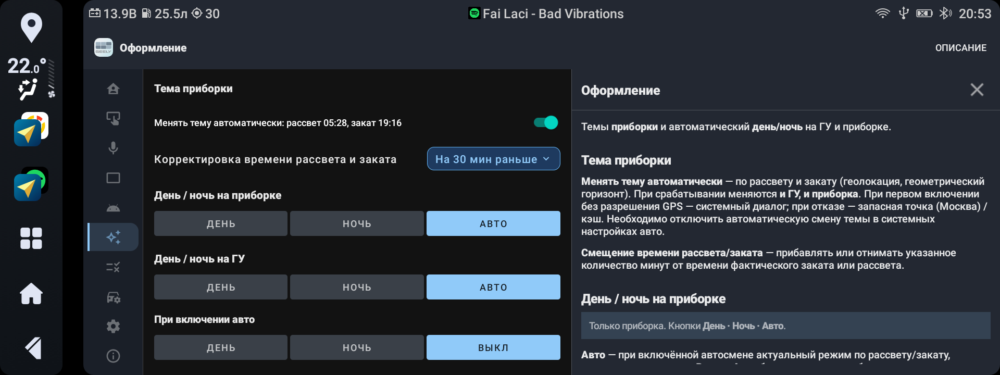 Оформление                                |
| 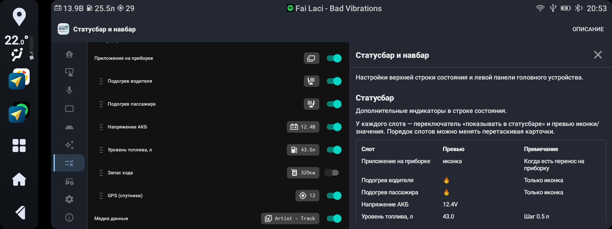 Статусбар                                | 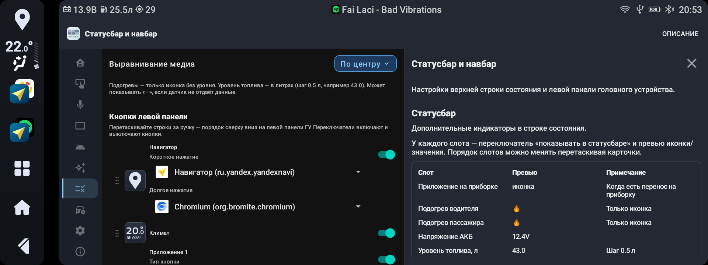 Навбар: навигатор         | 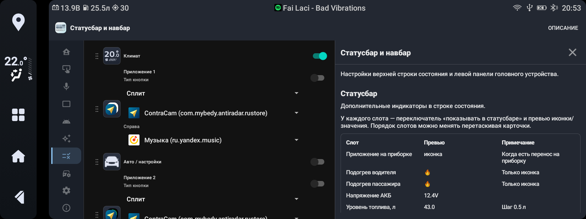 Навбар: слоты          | 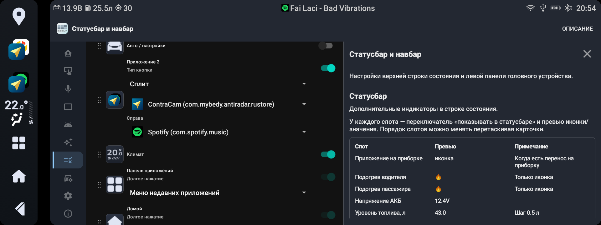 Навбар: сплит и домой          |
| 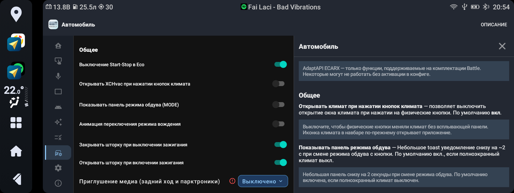 Автомобиль                              | 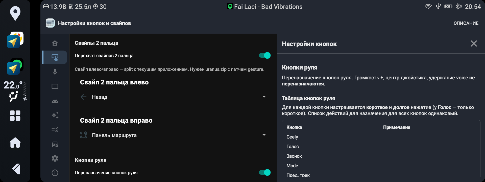 Кастомизация                   | 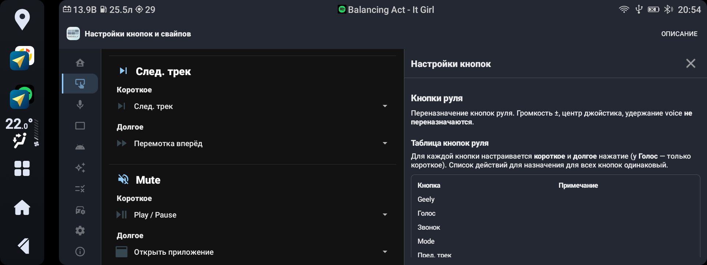 Кнопки руля              | 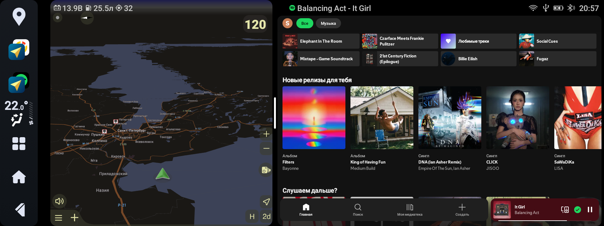 Сплит: карта и музыка          |

---

## 📦 Состав пакета

| Файл                      | Назначение                                                                                                                                |
| ------------------------- | ----------------------------------------------------------------------------------------------------------------------------------------- |
| `uranus.zip`              | Основной Magisk-модуль (приложение, патчи, LSPosed)                                                                                       |
| `uranus-vosk-model.zip`   | Модель для голосового управления                                                                                                          |
| `uranus-ynavi-magisk.zip` | Пропатченный Я.Навигатор *(опционально, нужен для передачи маршрута из «Куда едем?» в Я.Навигатор, виджета на приборке и Алисы с кнопки)* |
| `uranus.weather.apk`      | Виджет погоды для лаунчера *(опционально)*                                                                                                |

Актуальные версии и контрольные суммы - в комплекте установочных файлов (`VERSION.txt`, `SHA256SUMS`).

Отдельные модули `uranus-services-jar` и `uranus-xcsettings` больше не входят в пакет — при обновлении их нужно удалить в Magisk.

---

### Требования

- Geely Coolray **SX11A3 Battle Edition**, блок **IHU516** или **IHU535**
- Прошивка **[Community](https://4pda.to/forum/index.php?showtopic=1085149)**
- **Root** + **Magisk** с включённым **Zygisk**

### Перед установкой

Очистите кэш штатного XCHvac для корректного отображения иконки нового apk. В **Root Explorer** (или другом файловом менеджере с root) удалите файлы, в имени которых есть **XCHvac** в папке `/data/system/package_cache/`

Если обновляетесь с 3.x или с беты 4.0 — в Magisk удалите модули `uranus-services-jar` и `uranus-xcsettings`, если они ещё стоят.

### Порядок установки

> 📥 Скачайте установочные файлы из раздела **Releases** репозитория и установите их через Magisk. Порядок на 516 и 535 одинаковый.

1. **Magisk** → установить `uranus-vosk-model.zip` → **перезагрузка**
2. **Magisk** → установить `uranus.zip` → **перезагрузка**
  Если LSPosed ещё нет, он поставится вместе с модулем. Приложение Uranus отдельно ставить не нужно.
3. После загрузки откройте **LSPosed Manager**, включите модуль **Uranus** и **перезагрузитесь ещё раз**
4. **Magisk** → установить `uranus-ynavi-magisk.zip` *(опционально)* → перезагрузка *(передача маршрута из «Куда едем?» в Я.Навигатор, виджет на приборке, тема навигатора, Алиса с кнопки)*
5. **APK** → установить `uranus.weather.apk` → для появления виджета погоды в лаунчере

> ‼️ После установки зайдите в раздел «Голосовое управление» и перезагрузите голосовые команды, затем переназначьте кнопки руля, дайте пакету системные и root-права, выключите уведомления root-доступа в Magisk.

---

## 🛡 Отладка

- В разделе **системных настроек** есть возможность снятия логов. В случае обнаружения багов и ошибок - просьба оформлять issue и прикреплять архив логов

---

## 📋 Разделы приложения

> 💡 На каждой вкладке приложения есть кнопка **«Описание»** с подробной справкой по настройкам.

| Раздел                  | Что настраивается                                                                      |
| ----------------------- | -------------------------------------------------------------------------------------- |
| **Основное**            | Welcome-вкладка                                                                        |
| **Настройки кнопок**    | Переназначение кнопок руля, USB HID-громкость, свайпы                                  |
| **Голос**               | Голосовое управление, команды, микрофон                                                |
| **Приборная панель**    | Перенос, медиа, навигация, жесты                                                       |
| **Лаунчер**             | Виджеты, быстрый запуск, навбар; возврат на выбранный виджет через 15 / 30 / 45 секунд |
| **Оформление**          | Темы приборной панели, день/ночь                                                       |
| **Статусбар**           | Дополнительная информация в статусбаре                                                 |
| **Автомобиль**          | Климат, свет, сиденья, режимы                                                          |
| **Системные настройки** | Отладка, логи, ADB over Wi‑Fi                                                          |
| **О программе**         | Версии модуля и APK                                                                    |

---

## 🔗 Ссылки

- **[Community-прошивка SX11A3](https://4pda.to/forum/index.php?showtopic=1085149)** - тема на 4PDA
- **[Модель Vosk](https://alphacephei.com/vosk/models/vosk-model-small-ru-0.22)** - для распознавания голосовых команд

---

## 📜 Лицензия

Пакет Uranus распространяется на условиях **[Uranus Package License](LICENSE)** (личное некоммерческое использование).

---

## 🙏 Благодарности

- **[mark99](https://blog.mark99.ru/l)** - LunarisApp для Coolray ОД, материалы и наработки по ГУ Coolray ([blog.mark99.ru](https://blog.mark99.ru/l))
- **[dizz74](https://t.me/GeeOption)** - Community-прошивка и экосистема SX11A3 ([GeeOption Coolray](https://t.me/GeeOption))
- **[Muaddib_Rahim](https://t.me/rahim_mua)** - Многочисленные доработки и фиксы экосистемы Community
- **[Мансур](https://t.me/mansur)** - Ресурсы оформления климата/виджета
- **[Gcat@](https://t.me/gcat000)** - Тестирование на 535 блоке

---

## 👤 Автор

**sharkexe** - [Telegram](https://t.me/sharkexe)

Если Uranus оказался вам полезен - можно отблагодарить автора по QR-коду во вкладке **«Основное»** приложения или по ссылке: [CloudTips](https://pay.cloudtips.ru/p/314c11cd)

---

  Geely Coolray SX11A3 Battle Edition · IHU516 / IHU535 · Community firmware

