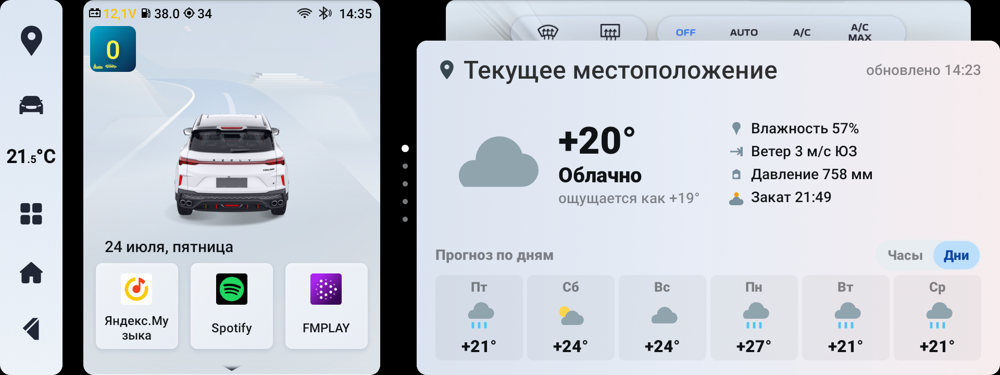
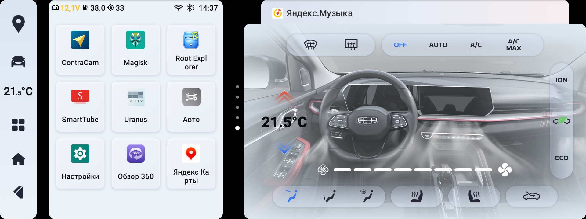
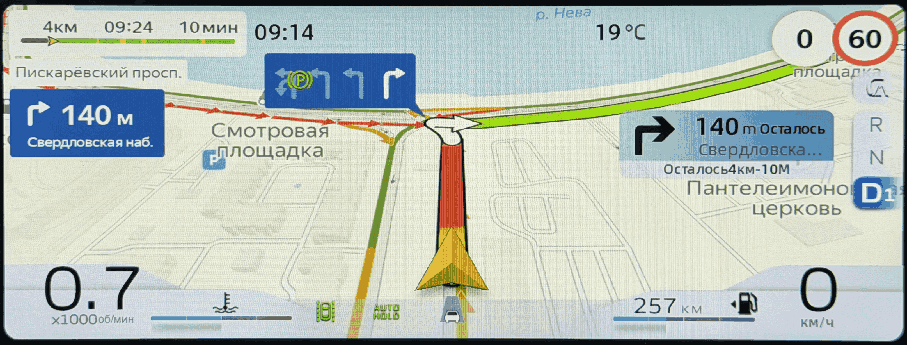
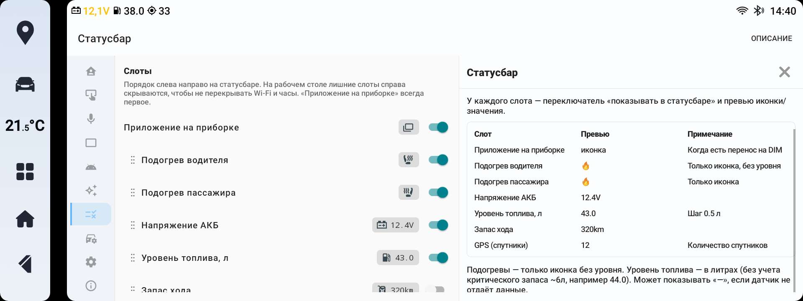
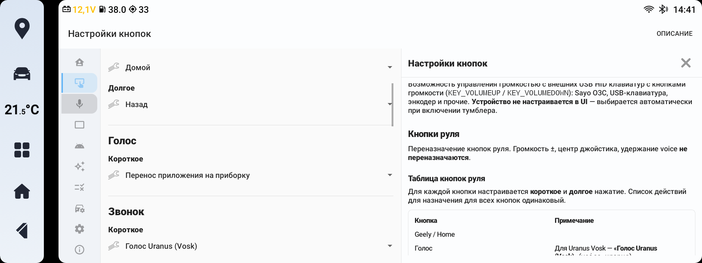
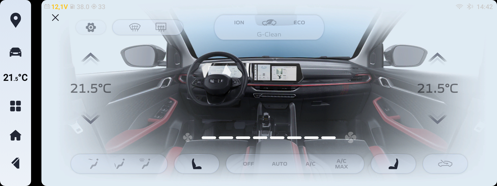

  
    
  
   
  Релиз: 31.07.2026

  <strong>Пакет расширений для Geely Coolray SX11A3 Battle Edition</strong> 
  Magisk-модуль и приложение настройки для головного устройства на блоке IHU516 (<a href="https://4pda.to/forum/index.php?showtopic=1085149">прошивка Community</a>)

  
  
  
  
  

---

## ✨ О проекте

**Uranus** - это пакет расширений для настройки **основного экрана ГУ** и **приборной панели**: перенос приложений на приборную панель, виджеты домашнего экрана, голосовое управление, темы, кнопки руля и другие ранее недоступные опции. 

---

## 🚀 Возможности

### 🖥️ Приборная панель

| Функция                   | Описание                                                                                                                                                                                                  |
| ------------------------- | --------------------------------------------------------------------------------------------------------------------------------------------------------------------------------------------------------- |
| 📲 **Перенос приложений** | Перенос приложений навигаторов и карт с основного экрана ГУ на приборную панель. Перенос осуществляется свайпом 3 пальцами влево или по кнопке на руле, возврат - 3 пальцами вправо или по кнопке на руле |
| 🎵 **Медиа-виджет**       | Вывод названия трека и исполнителя на приборной панели (Bluetooth, Я.Музыка и др.)                                                                                                                        |
| 🗺️ **Виджет навигации**  | Маршрут и подсказки на приборной панели (зависит от версии Я.Навигатора)                                                                                                                                  |
| 🎨 **Темы оформления**    | Выбор тем приборной панели, в том числе тематических праздничных тем, выключение синхронизации светлой и темной темы с основным экраном ГУ                                                                |

### ⚡ Основные возможности

#### Голосовое управление

| Функция                              | Описание                                                                                                              |
| ------------------------------------ | --------------------------------------------------------------------------------------------------------------------- |
| 🗣️ **Голосовая активация**          | Запуск голосового управления фразой («эй уран» и свои), по кнопке руля или обоим способами                            |
| 🎤 **Офлайн голосовое управление**   | Распознавание речи на модели **Vosk** — без интернета                                                                 |
| 📣 **Команды голосового управления** | Климат, окна, шторка, приложения, сплит, громкость и др.                                                            |

#### Кнопки руля и внешние устройства

| Функция                          | Описание                                                                                                                                                               |
| -------------------------------- | ---------------------------------------------------------------------------------------------------------------------------------------------------------------------- |
| 🎮 **Переназначение**            | Возможность назначить свои действия на штатные кнопки руля (короткое и долгое нажатие). Поддерживаются кнопки mode, voice, geely, call, mute, переключения треков      |
| 📋 **Действия переназначения**   | Для назначения доступны системные действия (домой, назад и тд), запуск приложений, голосовое управление, управление функциями и опциями авто, запуск сплит-скрина и тд |
| 🔇 **Управление громкостью USB** | Управление громкостью ГУ теперь доступно через любые HID-совместимые usb клавиатуры и девайсы с резистивными регуляторами громкости (крутилками)                       |

#### Виджеты рабочего стола и статусбар

| Функция                       | Описание                                                                                                                                                                                                       |
| ----------------------------- | -------------------------------------------------------------------------------------------------------------------------------------------------------------------------------------------------------------- |
| 📊 **Индикация в статусбаре** | Настраиваемые пиктограммы и информация о заряде АКБ, остатке топлива в литрах, запасе хода, количестве пойманных спутников GPS, индикация подогревов сидений и статусе переноса приложения на приборную панель |
| 🔘 **Smart Area - 3 кнопки**  | Настраиваемые слоты быстрого запуска приложений в панели Smart Area вна домашнем экране                                                                                                                        |
| 📱 **Smart Area - 9 слотов**  | Раскрывающаяся сетка 3×3 под Smart Area для быстрого запуска 9 любых приложений                                                                                                                                |
| 🎵 **Uranus.Медиа**           | Улучшенное отображение трека и управление - любой медиаисточник, включая Bluetooth                                                                                                                             |
| 🚗 **Uranus.Авто**            | Виджет настроек автомобиля: 10 настраиваемых слотов - память сидений, окна, режим мойки, смена темы и др.                                                                                                      |
| ❄️ **Uranus.Климат**          | Компактный климат-виджет на рабочем столе с быстрым доступом к основным функциям                                                                                                                               |
| 🌤️ **Uranus.Погода**         | Виджет погоды для лаунчера (отдельный APK)                                                                                                                                                                     |
| 🧩 **Свои виджеты**           | Возможность разработки и подключения пользовательских виджетов в каталог лаунчера                                                                                                                              |

#### Основной экран ГУ

| Функция                                     | Описание                                                                                                                   |
| ------------------------------------------- | -------------------------------------------------------------------------------------------------------------------------- |
| 🪟 **Разделение экрана**                    | Запуск сплит скрина с руля, голосом или с виджета лаунчера                                                                 |
| ↔️ **Изменение размера в сплите**           | Свободное перетаскивание разделителя между окнами                                                                          |
| ➡️ **Изменение дефолтных пропорций сплита** | Настройка дефолтных пропорций запуска сплит скрина, отличных от стоковых 620/1280                                          |
| 🧭 **Кнопка NAVI в навбаре**                | Переназначение короткого и долгого нажатия на кнопку навигатора в навбаре - запуск выбранных приложений                    |
| 🌓 **Темы день/ночь**                       | Автопереключение основного экрана ГУ и приборной панели по времени рассвета и заката, рассчитанные на основе вашей локации |
| 🔒 **КВН в шторке**                         | Быстрый доступ к КВН-клиенту из панели уведомлений                                                                         |

#### Автомобиль и климат

| Функция                           | Описание                                                                                                                      |
| --------------------------------- | ----------------------------------------------------------------------------------------------------------------------------- |
| 🌡️ **CN климат XCHvac**          | Замена штатного приложения климата на китайскую версию с переводом, красивыми ресурсами и исправленным багом анимации G-clean |
| 📐 **Климат без полноэкрана**     | Отключение полноэкранного режима климата при изменении температуры кнопками на панели                                         |
| 💨 **Уведомления обдува климата** | Всплывающая панель с текущим режимом обдува при нажатии кнопки MODE                                                           |
| 🪟 **Шторка по зажиганию**        | Автозакрытие и автооткрытие шторки при выключении и включении зажигания                                                       |
| 🚗 **Настройки авто**             | Свет, люк, сиденья, зеркала, режимы вождения, безопасность, память сиденья                                                    |

#### Сервис

| Функция                | Описание                                                                               |
| ---------------------- | -------------------------------------------------------------------------------------- |
| 🔧 **Инженерное меню** | Быстрый вход в OEM-инженерное меню из приложения                                       |
| 🛠️ **Диагностика**    | Отладка, логи, отступы для точной настройки отображения приложений на приборной панели |

---

## 📸 Скриншоты

<table>
  <tr>
    <td align="center" width="33%">
       
      Виджеты Uranus и Uranus.Погода
    </td>
    <td align="center" width="33%">
       
      Сетка приложений
    </td>
    <td align="center" width="33%">
       
      Сплит: Музыка и Навигатор
    </td>
  </tr>
  <tr>
    <td align="center" width="33%">
       
      Перенос на приборку и обратно
    </td>
    <td align="center" width="33%">
      
    </td>
    <td align="center" width="33%">
       
      Навигатор на приборке
    </td>
  </tr>
  <tr>
    <td align="center" width="33%">
       
      Слоты статусбара
    </td>
    <td align="center" width="33%">
       
      Кнопки руля и голос
    </td>
    <td align="center" width="33%">
       
      Климат XCHvac
    </td>
  </tr>
</table>

---

## 📦 Состав пакета

| Файл                      | Назначение                                           |
| ------------------------- | ---------------------------------------------------- |
| `uranus.zip`              | Основной Magisk-модуль (демон, сервисы, патчи OEM)   |
| `uranus-vosk-model.zip`   | Модель Vosk для голоса                               |
| `uranus-ynavi-magisk.zip` | Пропатченный Я.Навигатор версии 3.85 *(опционально)* |
| `uranus.weather.apk`      | Виджет погоды для лаунчера *(опционально)*           |

Актуальные версии и контрольные суммы - в комплекте установочных файлов (`VERSION.txt`, `SHA256SUMS`).

---

### Требования

- Geely Coolray **SX11A3 Battle Edition**, блок **IHU516**
- Прошивка **[Community](https://4pda.to/forum/index.php?showtopic=1085149)**
- **Root** + **Magisk**

### Перед установкой

Очистите кэш штатного XCHvac для корректного отображения иконки нового apk. В **Root Explorer** (или другом файловом менеджере с root) удалите файлы, в имени которых есть **XCHvac** в папке `/data/system/package_cache/`

### Порядок установки

> 📥 Скачайте установочные файлы из раздела **Releases** репозитория и установите их через Magisk

1. **Magisk** → установить `uranus.zip`
2. **Magisk** → установить `uranus-vosk-model.zip` → **перезагрузка**
3. **Magisk** → установить `uranus-ynavi-magisk.zip` *(Опционально)*  → перезагрузка *(трансляция маршрута навигатора в виджет на приборке и применение светлой и темной темы с системы в навигаторе и активация Алисы с кнопки)*
4. **APK** → установить `uranus.weather.apk` → для появления виджета погоды в лаунчере

> ‼️ После установки необходимо переназначить кнопки руля в соответствующем разделе, дать пакету необходимые системные и root права, выключить уведомления root-доступа в Magisk.

---

## 🛡 Отладка

- В разделе **системных настроек** есть возможность снятия логов. В случае обнаружения багов и ошибок - просьба оформлять issue и прикреплять архив логов

---

## 📋 Разделы приложения

> 💡 На каждой вкладке приложения есть кнопка **«Описание»** с подробной справкой по настройкам.

| Раздел                  | Что настраивается                             |
| ----------------------- | --------------------------------------------- |
| **Основное**            | Welcome-вкладка                               |
| **Настройки кнопок**    | Переназначение кнопок руля, USB HID-громкость |
| **Голос**               | Голосовое управление, команды, микрофон       |
| **Приборная панель**    | Перенос, медиа, навигация, жесты              |
| **Лаунчер**             | Виджеты, быстрый запуск, кнопка навигатора    |
| **Оформление**          | Темы приборной панели, день/ночь              |
| **Статусбар**           | Дополнительная информация в статусбаре        |
| **Автомобиль**          | Климат, свет, сиденья, режимы                 |
| **Системные настройки** | Отладка, логи                                 |
| **О программе**         | Версии модуля и APK                           |

---

## 🔗 Ссылки

- **[Community-прошивка SX11A3](https://4pda.to/forum/index.php?showtopic=1085149)** - тема на 4PDA
- **[Модель Vosk](https://alphacephei.com/vosk/models/vosk-model-small-ru-0.22)** - для распознавания голосовых команд

---

## 📜 Лицензия

Пакет Uranus распространяется на условиях **[Uranus Package License](LICENSE)** (личное некоммерческое использование).

---

## 🙏 Благодарности

- **[mark99](https://blog.mark99.ru/l)** - LunarisApp для Coolray ОД, материалы и наработки по ГУ Coolray ([blog.mark99.ru](https://blog.mark99.ru/l))
- **[dizz74](https://t.me/GeeOption)** - Community-прошивка и экосистема SX11A3 ([GeeOption Coolray](https://t.me/GeeOption))

---

## 👤 Автор

**sharkexe** - [Telegram](https://t.me/sharkexe)

Если Uranus оказался вам полезен - можно отблагодарить автора по QR-коду во вкладке **«Основное»** приложения или по ссылке: [CloudTips](https://pay.cloudtips.ru/p/314c11cd)

---

  Geely Coolray SX11A3 Battle Edition · IHU516 · Community firmware

